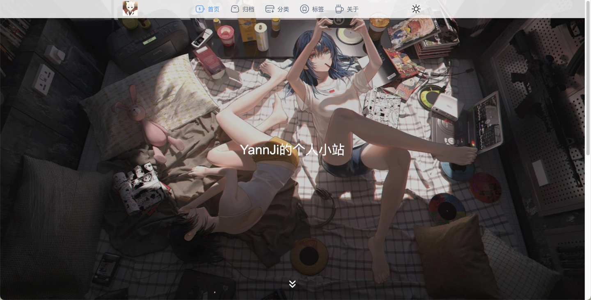

<h1 align="center" style="margin: 30px 0 30px; font-weight: bold;">Blog</h1>
<h3 align="center">前后端分离模式下的SSR博客系统</h3>

### 目录说明
``` lua
blog
├── blog-java -- 后端API接口系统
└── blog-ui -- 前端系统
     ├── blog-admin -- Web后台管理系统
     └── blog-front -- Web前台系统
├── docker -- Docker构建部署
└── images -- 图片
```

### 技术栈说明
#### 后端技术栈
1. SpringBoot2.5.6
2. Sa-Token1.34.0
3. MybatisPlus3.5.2
4. MySQL8.0.23
5. Redis6
#### 前端技术栈
1. Nuxt.js3.x
2. Vue.js3.x
3. Vite4.x
4. ElementPlus

### 预览
|                                 |                                |
|:-------------------------------:|:------------------------------:|
|        |     |
|      |   |


